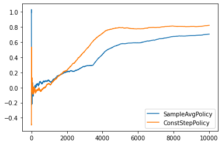

# Chapter 2 Exercises
### Exercise 2.1
**如果是*ε-贪婪*动作选择，对于两个动作且ε = 0.5的情况，贪婪动作被选择的概率是？**

概率是75%，由两部分构成：
- 50%概率源自选择贪婪动作，即1-ε = 1-0.5 = 0.5
- 25%概率源自随机动作，即ε*(1/2) = 0.25

### Exercise 2.2: *赌博机的例子*
**考虑一个*k*=4的多臂赌博机问题，几座1、2、3、4。将赌博机算法应用于这个问题，算法使用ε-贪婪动作选择，基于采样平均的动作价值估计，初始估计Q₁(*a*) = 0，<!-- $\forall a$ --> 。假设初始动作序列和回报是A₁ = 1, R₁ = -1, A₂ = 2, R₂ = 1, A₃ = 2, R₃ = -2, A₄ = 2, R₄ = 2, A₅ = 3, R₅ = 0。在某些时刻可能发生ε的情形，导致一个动作被随机选择。在哪个时刻这个情形肯定发生了？在哪个时刻这个情形可能发生了？**

通过表格计算$Q_t(a)$可确定贪心动作的范围:

   * 时刻 1:  0, 0, 0, 0, 0，贪心动作<!-- $\in\{1,2,3,4,5\}$ --> ，实际动作1，可能是随机
   * 时刻 2:  -1, 0, 0, 0, 0，贪心动作<!-- $\in\{2,3,4,5\}$ --> ，实际动作2，可能是随机
   * 时刻 3:  -1, 1, 0, 0, 0，贪心动作<!-- $\in\{2\}$ --> ，实际动作2，可能是随机
   * 时刻 4:  -1, -0.5, 0, 0, 0，贪心动作<!-- $\in\{3,4,5\}$ --> ，实际动作2，一定是随机
   * 时刻 5:  -1, 0.33, 0, 0, 0，贪心动作<!-- $\in\{2\}$ --> ，实际动作3，一定是随机

### Exercise 2.3:
**在图2.2的对比中, 从累计收益和选择最佳动作的概率大角度考虑，哪一个方法会在长期表现最好？好多少？定量地表述你的答案。**

表现最好的方法会是ε=0.01的ε-贪心方法。虽然ε=0.1的ε-贪心方法在1000步表现更好，但是长期来看ε=0.01的ε-贪心方法会更好。因为步数趋于无穷时，两个方法的期望收益都会收敛到真实收益。由于ε=0.01的随机性比ε=0.1更小，ε=0.01具有更高的收益。

定量地说，我们可以估计期望收益，也就是<!-- $\mathbb{E}^{\epsilon}[R_t]=(1-\epsilon)\max_a Q_t(a) + \epsilon \sum_{i=1}^{10} Q_t(i)$ --> 。将<!-- $Q_{t}(a)=q_*(a)$ --> 代入得<!-- $\mathbb{E}^{\epsilon}[R_t]=(1-\epsilon)\max_a q_*(a) + \epsilon \sum_{i=1}^{10} q_*(i)$ --> 。实际价值<!-- $q_*(a)$ --> 是采样自一个均值为0方差为1的标准正态分布，所以将<!-- $\sum_{i=1}^{10} q_*(i)=0$ --> 带入得<!-- $\mathbb{E}^{\epsilon}[R_t]=(1-\epsilon)\max_a q_*(a)$ --> 。所以ε=0.01比ε=0.1期望收益高，前者是后者的(1-0.01)/(1-0.1)=1.1倍。

### Exercise 2.4:
**如果步长参数$\alpha_n$不是常数，那么估计$Q_n$就是一个前面接受的收益的加权平均，其权值与公式(2.6)给出的不同。对于这个步长参数，类似于公式(2.6)，每个先前收益的权重的通用表达式是什么？**

<!-- $\begin{align*}
Q_{n+1}&=Q_n + \alpha_n(R_n-Q_n) \\
&=\alpha_n R_n + (1-\alpha_n)Q_n \\
&=\alpha_n R_n + (1-\alpha_n) (\alpha_{n-1} R_{n-1} + (1-\alpha_{n-1})Q_{n-1}) \\
&=\alpha_n R_n + (1-\alpha_n) \alpha_{n-1} R_{n-1} + (1-\alpha_n)(1-\alpha_{n-1})Q_{n-1} \\
&=\alpha_n R_n + (1-\alpha_n) \alpha_{n-1} R_{n-1} + (1-\alpha_n)(1-\alpha_{n-1})(\alpha_{n-2} R_{n-2} + (1-\alpha_{n-2})Q_{n-2}) \\
&=\alpha_n R_n + (1-\alpha_n) \alpha_{n-1} R_{n-1} + (1-\alpha_n)(1-\alpha_{n-1})\alpha_{n-2} R_{n-2} + (1-\alpha_n)(1-\alpha_{n-1})(1-\alpha_{n-2})Q_{n-2} \\
&=(\prod_{i=1}^n{1-\alpha_i})Q_1 + \sum_{i=1}^{n} (\alpha_i \prod_{j=i+1}^n{1-\alpha_j})R_{i}
\end{align*}$ --> 
题目答案是<!-- $R_i$ --> 的权重<!-- $\alpha_i \prod_{j=i+1}^n{1-\alpha_j}$ --> 。

### Exercise 2.5：
**设计并且实施一项实验来证实采用采样平均方法去解决非平稳问题的困难。使用一个10臂测试平台的修改版本，其中所有的<!-- $q_*(a)$ --> 初始时相等，然后进行随机游走（比如说每一步所有的<!-- $q_*(a)$ --> 都加上一个均值为0标准差为0.01的正态分布的增量）。为其中一个使用采样平均和增量式计算的动作-价值方法，为另一个使用常数步长参数且<!-- $\alpha=0.1$ --> 的动作-价值方法，并做出如图2.2所示的分析。采用<!-- $\epsilon=0.1$ --> ，并且取很长的时间（比如10 000步）。**

代码见[ex2.5.ipynb](./ex2.5.ipynb)

### Exercise 2.6: *神秘峰值*
**图2.3的结果应该非常可靠，因为平均了2000次独立随机选择的10臂赌博机任务。为什么乐观方法的早巡还是有振荡和峰？换句话说，设计一个思想实验，分析哪些情况可能导致这个方法在特定早巡平均表现更好或更坏。**

- 初始化时，当乐观值远大于真值，且恰好选中了真值的期望最高的臂，不妨叫a臂，那么**曲线上升**。
- 而此番更新估计值后，a臂的估计值虽然下降逼近真值期望，但还是介于真值期望与乐观值之间。而其余臂的估计值比a臂更大，决策就会选择其他的臂，那么曲线**陡然下降**，其余的臂也更新估计值。
- 此番更新后，因为其余臂的真值期望小于a臂，那么其余臂的估计值必然都小于a臂，那么a臂在持续一段时间被选择，那么曲线**陡然上升**。
- 这样的上升下降反复交替，因此曲线在早巡振荡。因为a臂的估计值会从乐观值下降逼近真值期望，所以当其余臂的估计值全都小于a臂真值期望时，振荡会结束。

### Exercise 2.7:
**无偏恒定步长技巧 在本章的大部分内容中，我们使用采样平均值来估计动作价值，因为样本平均值不会像恒定步长一样产生偏差，参见式（2.6）的分析。 然而，采样平均值并不是一个完全令人满意的解决方案，因为它们可能在非平稳问题上表现不佳。是否有可能避免不变步长的偏差，同时保留其对非平稳问题的优势？一种方法是使用如下步长处理特定动作的第n个受益**

<!-- $\beta_n\doteq\alpha/\bar{o}_n,$ --> 

**其中<!-- $\alpha>0$ --> 是传统的恒定步长，<!-- $\bar{o}_n$ --> 是从零时刻开始的修正系数：**

<!-- $\bar{o}_n\doteq\bar{o}_{n-1}+\alpha(1-\bar{o}_{n-1}), \mathrm{for} \: n\ge0, \mathrm{with} \: \bar{o} \doteq 0$ --> 

**通过与式（2.6）类似的分析方法，试证明<!-- $Q_n$ --> 是一个*对初始值无偏*的指数近因加权平均。**

**1. 证明对初始值无偏：**

用练习2.4的结论：

<!-- $\begin{align*}
Q_{n+1}&=Q_n + \alpha_n(R_n-Q_n) \\
&=(\prod_{i=1}^n{1-\alpha_i})Q_1 + \sum_{i=1}^{n} (\alpha_i \prod_{j=i+1}^n{1-\alpha_j})R_{i}
\end{align*}$ --> 

将上式<!-- $\alpha_i$ --> 替换为<!-- $\beta_i$ --> ：

<!-- $\begin{align*}
Q_{n+1}&=Q_n + \beta_n(R_n-Q_n) \\
&=(\prod_{i=1}^n{1-\beta_i})Q_1 + \sum_{i=1}^{n} (\beta_i \prod_{j=i+1}^n{1-\beta_j})R_{i}
\end{align*}$ --> 

将<!-- $\beta_1=\alpha/\bar{o}_1=\alpha/(\bar{o}_0+\alpha(1-\bar{o}_0))=\alpha/(0+\alpha(1-0))=\alpha/\alpha=1$ --> 代入上式：

<!-- $
Q_{n+1}=\sum_{i=1}^{n} (\beta_i \prod_{j=i+1}^n{1-\beta_j})R_{i}
$ --> 

得证。

**2. 证明是指数近因加权**

只要证：

<!-- $\begin{align*}
\frac{\beta_k \prod_{j=k+1}^n{1-\beta_j}}{\beta_{k+1} \prod_{j=k+2}^n{1-\beta_j}}=\frac{\beta_1 \prod_{j=2}^n{1-\beta_j}}{\beta_{2} \prod_{j=3}^n{1-\beta_j}} \tag{2.7.1}
\end{align*}$ --> 

(2.7.1)式等号右边化简：

<!-- $\begin{align*}
\frac{\beta_1 \prod_{j=2}^n{1-\beta_j}}{\beta_{2} \prod_{j=3}^n{1-\beta_j}}=\frac{\beta_1(1-\beta_2)}{\beta_2}\tag{2.7.2}
\end{align*}$ --> 

将<!-- $\beta_1=1$ -->  和 

<!-- $\begin{align*}
\beta_2&=\alpha/\bar{o}_2\\
&=\alpha/(\bar{o}_1+\alpha(1-\bar{o}_1))\\
&=\alpha/(\alpha+\alpha(1-\alpha))\\
&=\alpha/(2\alpha-\alpha^2)\\
&=\frac{1}{2-\alpha}
\end{align*}$ -->  

代入(2.7.2)式：

<!-- $\begin{align*}
\frac{\beta_1 \prod_{j=2}^n{1-\beta_j}}{\beta_{2} \prod_{j=3}^n{1-\beta_j}}&=\frac{1(1-\frac{1}{2-\alpha})}{\frac{1}{2-\alpha}}\\
&=\frac{\frac{1-\alpha}{2-\alpha}}{\frac{1}{2-\alpha}}\\
&=1-\alpha\tag{2.7.3}
\end{align*}$ --> 

(2.7.1)式等号左边化简：

<!-- $\begin{align*}
\frac{\beta_k \prod_{j=k+1}^n{1-\beta_j}}{\beta_{k+1} \prod_{j=k+2}^n{1-\beta_j}}&=\frac{\beta_k(1-\beta_{k+1})}{\beta_{k+1}} \\
&=\frac{\beta_k}{\beta_{k+1}}-\beta_k\\
&=\frac{\alpha/\bar{o}_k}{\alpha/\bar{o}_{k+1}}-\alpha/\bar{o}_k\\
&=\frac{\bar{o}_{k+1}-\alpha}{\bar{o}_{k}}\\
&=\frac{\bar{o}_k+\alpha(1-\bar{o}_k)-\alpha}{\bar{o}_k}\\
&=1-\alpha
\tag{2.7.4}
\end{align*}$ --> 

所以(2.7.1)式成立，指数近因加权得证。

### Exercise 2.8: *UCB尖峰*
**在图2.4中，UCB算法的表现在第11步的时候有一个非常明显的尖峰。为什么会产生这个尖锋呢？请注意，必须同时解释为什么收益在第11步时会增加，以及为什么在后续的若干步中会减少，答案才令人满意。（提示：如果c=1，那么这个尖峰就不会那么突出了。）**

由于$N_t(a)=0$，则a是满足最大化条件的动作，所以第一步到第十步间10个动作每个都被选择了一次$N_t(a)=1$。

记置信估计为：

$\begin{align*}
C_t(a)&=c\sqrt{\frac{\ln t}{N_t(a)}}\\
\end{align*}$

$t=11$ , $N_t(a)=1$ 且 $c=2$ 的置信估计为：
$\begin{align*}
C_t(a)&=2\sqrt{\frac{\ln 11}{1}}\\
&\approx 3.1
\end{align*}$

此时，10个动作的置信估计都为3.1，收益估计最大的动作，不妨记为A被选择，曲线上升。

在12步，其余9个动作被选择第二次之前的置信估计都为：

$\begin{align*}
C_t(a)&=2\sqrt{\frac{\ln 12}{1}}\\
&\approx 3.15
\end{align*}$

只有A的置信估计是：

$\begin{align*}
C_t(a)&=2\sqrt{\frac{\ln 12}{2}}\\
&\approx 1.11
\end{align*}$

此时A比其他动作的置信估计小2.04，只有当A之前的收益估计比其余动作的收益估计都大2.04才会继续选择A。而每个动作的收益真值采样自均值为0方差为1的高斯分布，2.04相当于两个标准差。已知标准正态分布的函数曲线下$P=68.268949\%$的面积在平均数左右一个标准差内，计算假设恰好A的收益真值比其余动作的真值都大两个标准差的概率：
$((1-P)/2)^{10}\approx1e^{-8}$

换句话说，A的收益真值比其余动作的真值都大两个标准差的事件几乎不能发生。所以12步时会选择A以外的动作，曲线陡然下降。

同理在13-20步，会按照收益估计从高往低，选择$N_t(a)=1$的其他动作，所以后续若干步曲线下降。